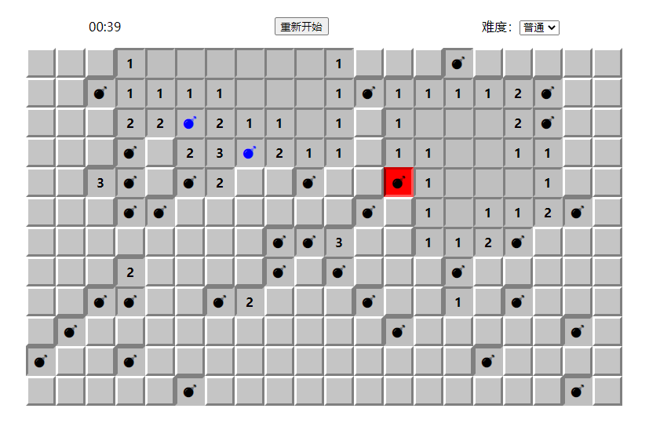

# JS 实现扫雷

`src/classes/MineSweeper.js` 封装了扫雷的类，可以直接使用，项目也基于 Vue 实现了扫雷页面。



实现的基本思路：

1. 根据难度生成方格二维数组；
2. 用户点击某个方格，如果是雷，则游戏结束并高亮所有雷；
3. 如果用户点击的方格没有雷，则高亮该方格，并显示周围雷的数量，如果数量为0，对周围的方格重复执行该操作；
4. 第3步每次执行完，都检查扫雷是否已完成；
5. 用户右键非高亮方格，依次显示/旗子/问号/空白。

## 几个关键点

### 1.基本属性

```js
MineSweeper {
  difficulty,
  map,
  finished
}
```

- difficulty：难度，参考 `src/utils/difficulties.js`，例如：`{ id: 1, name: '简单', row: 6, col: 10, mines: 9 }`
- map：方格二维数组，根据难度生成，每个方格的值参考第2点
- finished：Boolean，表示游戏是否结束（完成或者踩雷都算结束）

### 2.方格结构

定义每个方格的结构：

```js
const grid = {
  row: i,
  col: j,
  isMine: false,
  active: false,
  mineCountAround: 0,
  flag: false,
  question: false
}
```

- row：方格所在行，从0开始
- col：方格所在列，从0开始
- isMine：Boolean，表示该方格有没有雷
- active：Boolean，表示单元格是否高亮
- mineCountAround：Number，周围雷数量，该值初始化时为0，只有用户点击方格才会计算并显示
- flag：Boolean，是否插旗，该值与 active 和 question 互斥
- question: Boolean，是否标记问号，该值与 active 和 flag 互斥

### 3.获取周围雷数量

要获取周围雷数量，先要获取周围方格列表（边缘方格需要剔除无效的方格）：

```js
// 获取周围方格
MineSweeper.prototype.getGridsAround = function (row, col) {
  let grids = [
    { row: row - 1, col: col - 1 },
    { row: row - 1, col },
    { row: row - 1, col: col + 1 },
    { row, col: col - 1 },
    { row, col: col + 1 },
    { row: row + 1, col: col - 1 },
    { row: row + 1, col },
    { row: row + 1, col: col + 1 }
  ]
  grids = grids
    .filter(grid => grid.row >= 0 && grid.row < this.difficulty.row && grid.col >= 0 && grid.col < this.difficulty.col) // this.difficulty.row 和 this.difficulty 表示网格的行数和列数
    .map(grid => this.map[grid.row][grid.col])
  return grids
}
```

在实际扫雷游戏中，当某个方格的周围雷数量为0，并非只显示0，而是会继续显示这些方格周围方格的数量，如果周围的方格的周围雷数量依旧为0，重复此操作，该过程可以用递归实现：

```js
// 排雷（显示雷数量，如果周围方格有0，则对周围方格重复此操作）
MineSweeper.prototype.sweepMines = function (row, col) {
  const grid = this.map[row][col]
  if (grid.active) {
    return false
  }
  grid.active = true
  grid.mineCountAround = this.getMineCountAround(row, col)
  if (grid.mineCountAround === 0) {
    const gridsAround = this.getGridsAround(row, col)
    gridsAround.forEach(grid => {
      this.sweepMines(grid.row, grid.col)
    })
  }
  return this.checkFinished()
}
```

4.检查扫雷是否完成

每一步排雷之后，应当检查扫雷是否完成，判断的依据是：是否每一个非雷的方格都被高亮